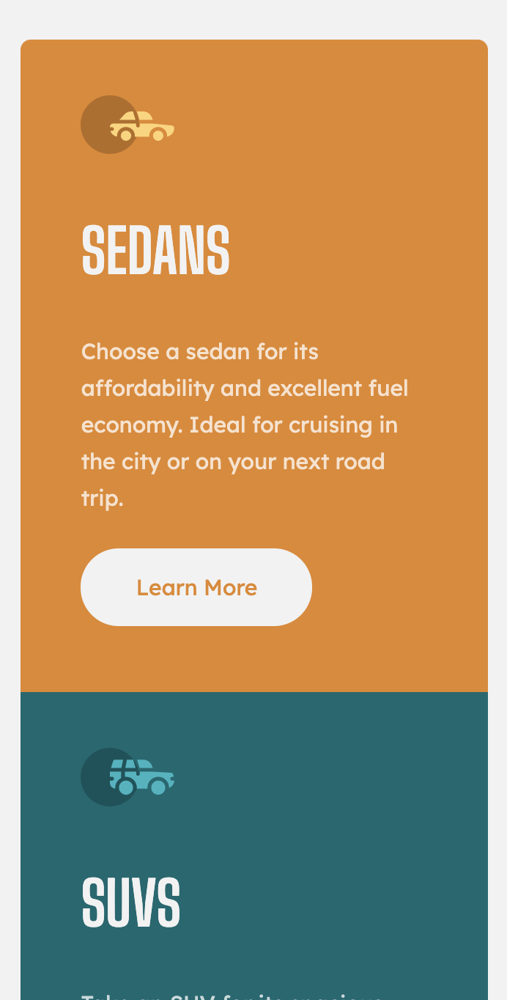
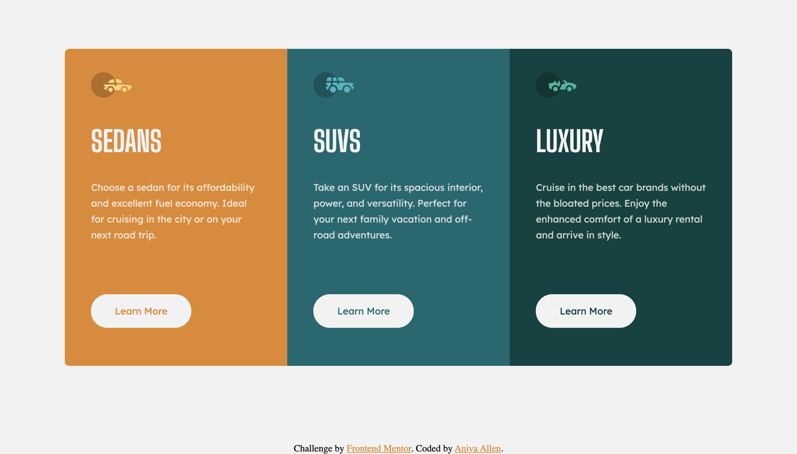

# Frontend Mentor - 3-column preview card component solution

This is a solution to the [3-column preview card component challenge on Frontend Mentor](https://www.frontendmentor.io/challenges/3column-preview-card-component-pH92eAR2-). Frontend Mentor challenges help you improve your coding skills by building realistic projects.

## Table of contents

- [Overview](#overview)
  - [The challenge](#the-challenge)
  - [Screenshot](#screenshot)
  - [Links](#links)
- [My process](#my-process)
  - [Built with](#built-with)
  - [What I learned](#what-i-learned)
  - [Continued development](#continued-development)
  - [Useful resources](#useful-resources)
- [Author](#author)

## Overview

### The challenge

Users should be able to:

- View the optimal layout depending on their device's screen size
- See hover states for interactive elements

### Screenshot

| Mobile (375px)                                 | Desktop (1440px)                                 |
| ---------------------------------------------- | ------------------------------------------------ |
|  |  |

### Links

- Solution URL: [(https://github.com/amallen1/columnPreviewCard)]
- Live Site URL: [(https://zealous-engelbart-7f667d.netlify.app/)]

## My process

### Built with

- Semantic HTML5 markup
- SCSS
- CSS Grid
- Flexbox
- Mobile-first workflow

### What I learned

This was a project I attempted when I first began my web development journey. The first attempt I ended up quitting momentarily because I didn't understand basic concepts like responsive design, positioning, units, and etc. I went back and studied these concepts and applied it to this project so it would be fully functioning and closely resemble the original design. I've learned a ton of HTML and CSS since my first attempt at this and I'm very proud at how the final result came out.

### Continued development

I added a transition that enlarges the cards when you hover over any one of them.

### Useful resources

- [Scrimba](https://scrimba.com/)

## Author

- Frontend Mentor - [@amallen1](https://www.frontendmentor.io/profile/amallen1)
